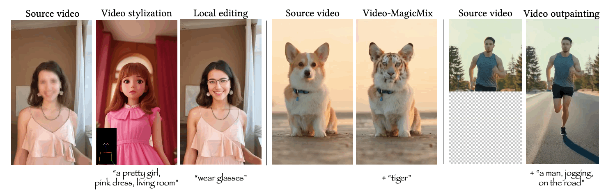

<!-- # magic-edit.github.io -->

<p align="center">

  <h2 align="center">MagicEdit: High-Fidelity and Temporally Coherent Video Editing</h2>
  <p align="center">
    <a href="https://scholar.google.com.sg/citations?user=8gm-CYYAAAAJ&hl=en"><strong>Jun Hao Liew*</strong></a>
    ·  
    <a href="https://hanshuyan.github.io/"><strong>Hanshu Yan*</strong></a>
    ·
    <a href="http://jeff95.me/"><strong>Jianfeng Zhang</strong></a>
    ·
    <a href="https://scholar.google.com/citations?user=-4iADzMAAAAJ&hl=en"><strong>Zhongcong Xu</strong></a>
    ·
    <a href="https://sites.google.com/site/jshfeng/home"><strong>Jiashi Feng</strong></a>
    <br>
    ByteDance Inc.
    <br>
    </br>
        <a href="https://arxiv.org/abs/2308.14749">
        
        </a>
        <a href='https://magic-edit.github.io/'>
        </a>
  </p>
  <div align="center">
    
    </video>
  </div>
</p>

*MagicEdit explicitly disentangles the learning of appearance and motion to achieve high-fidelity and temporally coherent video editing. It supports various editing applications, including video stylization, local editing, video-MagicMix and video outpainting.*

*For avatar-centric video generation and animation, please also check our latest work <a href="https://magic-avatar.github.io/">MagicAvatar</a>!*

 
## Citing
If you find our work useful, please consider citing:
```BibTeX
@inproceedings{liew2023magicedit,
    author      = {Liew, Jun Hao and Yan, Hanshu and Zhang, Jianfeng and Xu, Zhongcong and Feng, Jiashi},
    title       = {MagicEdit: High-Fidelity and Temporally Coherent Video Editing},
    booktitle   = {arXiv},
    year        = {2023}
}
```
